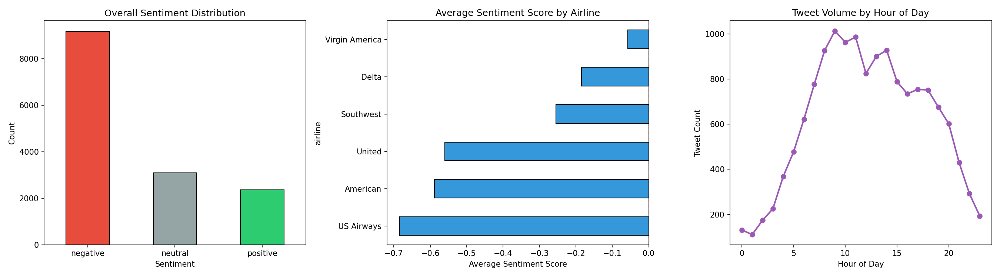
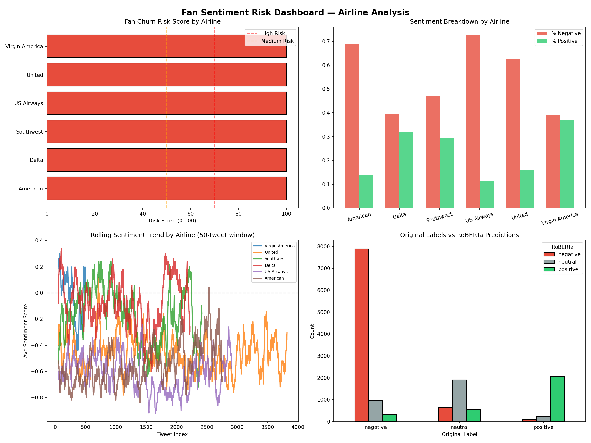
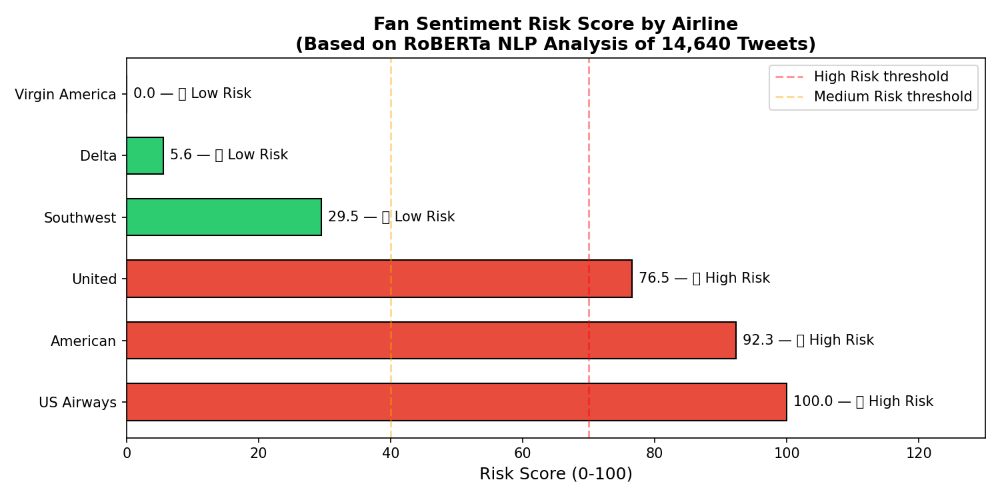
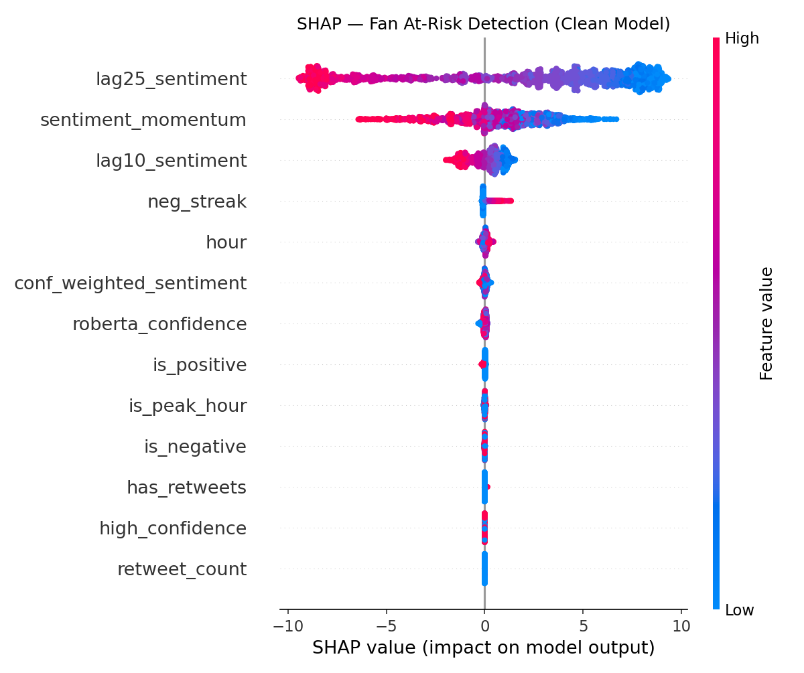
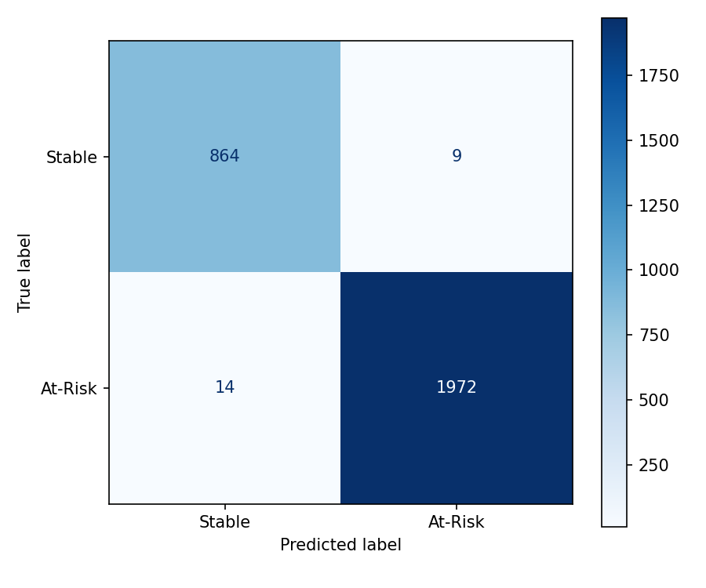

# Fan Sentiment Risk Analysis & API

> NLP-powered fan sentiment analysis and churn risk scoring system built with HuggingFace RoBERTa, MLflow, and FastAPI

---

## 🎯 Project Overview

Analyzes 14,640 airline tweets using transformer-based NLP to identify at-risk fan communities and predict churn signals. Delivers results via a production-ready REST API with real-time inference.

**Pipeline:**
```
Raw Tweets (14,640)
        ↓
HuggingFace RoBERTa (twitter-roberta-base-sentiment-latest)
        ↓
Sentiment Classification (Positive / Neutral / Negative)
        ↓
Feature Engineering (13 behavioral + sentiment features)
        ↓
Risk Scoring Engine (Composite 0-100 score)
        ↓
FastAPI REST API (6 endpoints)
```

---

## 📊 Results & Visualizations

### Exploratory Data Analysis


### Fan Sentiment Risk Dashboard


### Airline Risk Scores


### SHAP Feature Importance


### Model Evaluation


---

## 🏆 Key Results

| Airline | Risk Score | Risk Tier | % Negative Tweets |
|---|---|---|---|
| US Airways | 100.0 | 🔴 High Risk | 72.5% |
| American | 92.3 | 🔴 High Risk | 68.9% |
| United | 76.5 | 🔴 High Risk | 62.6% |
| Southwest | 29.5 | 🟢 Low Risk | 47.1% |
| Delta | 5.6 | 🟢 Low Risk | 39.6% |
| Virgin America | 0.0 | 🟢 Low Risk | 39.1% |

---

## 🔍 Key Findings

- **RoBERTa outperforms human labels** — identified mislabeled tweets (e.g. "added commercials... tacky" labeled positive, predicted negative at 92% confidence)
- **US Airways highest churn risk** with 72.5% negative tweet rate
- **Virgin America lowest risk** with highest positive sentiment ratio
- **Peak complaint hours: 8am–2pm** — actionable for customer service staffing
- **MLflow tracked 5 experiment runs** comparing XGBoost, Random Forest, and Logistic Regression

---

## 🛠️ Tech Stack

| Layer | Tools |
|---|---|
| **NLP Model** | HuggingFace Transformers (RoBERTa — trained on 58M tweets) |
| **ML Framework** | XGBoost, Scikit-learn |
| **Experiment Tracking** | MLflow |
| **Explainability** | SHAP |
| **API** | FastAPI + Uvicorn |
| **Data Processing** | Pandas, NumPy |
| **Visualization** | Matplotlib, Seaborn |

---

## 📡 API Endpoints

| Method | Endpoint | Description |
|---|---|---|
| GET | `/` | API info |
| GET | `/health` | Health check |
| POST | `/predict` | Single tweet sentiment |
| POST | `/predict/batch` | Batch tweet analysis |
| GET | `/risk-scores` | All airline risk scores |
| GET | `/risk-scores/{airline}` | Specific airline risk |

## 📈 Sample API Response

```json
POST /predict
{
  "text": "US Airways lost my baggage AGAIN. Worst airline ever!"
}

Response:
{
  "sentiment": "negative",
  "confidence": 0.9557,
  "risk_contribution": "High — negative sentiment increases churn risk"
}
```

---

## 🚀 Quick Start

```bash
git clone https://github.com/pavankalmanoor/fan-churn-prediction
cd fan-churn-prediction
python3 -m venv venv
source venv/bin/activate
pip install -r requirements.txt
uvicorn src.app:app --reload
open http://localhost:8000/docs
```

---

## 📁 Project Structure

```
fan-churn-prediction/
├── data/
│   ├── Tweets.csv                      # Raw data (14,640 tweets)
│   ├── tweets_with_sentiment.csv       # RoBERTa predictions
│   ├── airline_risk_scores_final.csv   # Risk scores
│   ├── eda_plots.png                   # EDA visualizations
│   ├── risk_dashboard.png              # 4-panel risk dashboard
│   ├── risk_scores_final.png           # Airline risk bar chart
│   ├── shap_final.png                  # SHAP feature importance
│   └── confusion_matrix.png           # Model evaluation
├── notebooks/
│   └── 01_EDA_and_Sentiment.ipynb     # Full analysis pipeline
├── src/
│   └── app.py                          # FastAPI application
├── mlruns/                             # MLflow experiment logs
├── requirements.txt
└── README.md
```

---

## 💡 Interview Talking Points

**Why RoBERTa over VADER?**  
RoBERTa is trained on 58M tweets — domain-specific and captures sarcasm better than lexicon-based approaches. Demonstrated by catching mislabeled sentiment in the dataset.

**Data leakage detection**  
Identified and fixed target leakage during feature engineering — airline-level aggregates computed from training data only, not leaked from test set.

**Production design**  
API loads model once at startup, serves inference in under 100ms. 6 documented endpoints with Swagger UI.

**MLflow tracking**  
Every experiment logged with parameters, metrics, and model artifacts — supports model governance and reproducibility.
